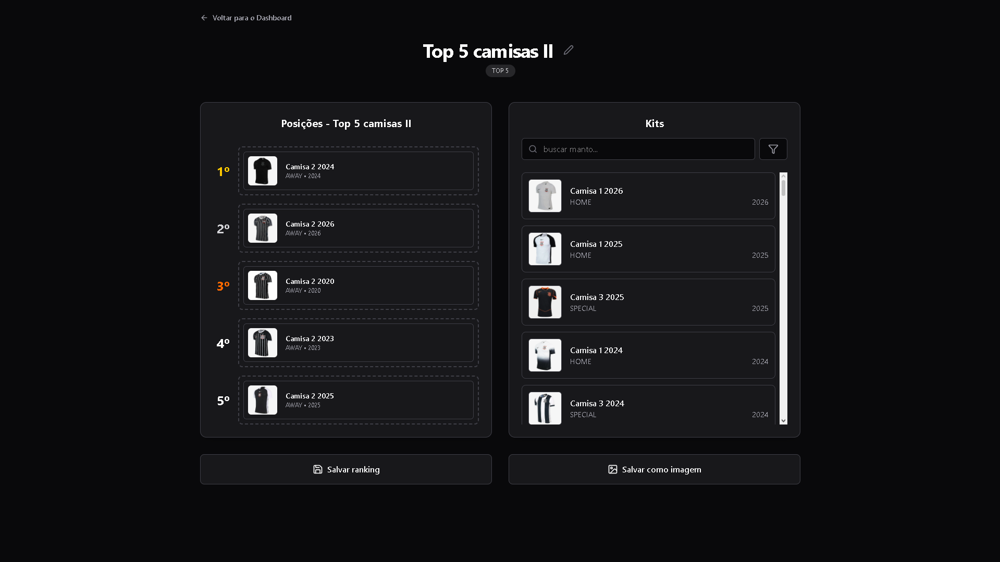
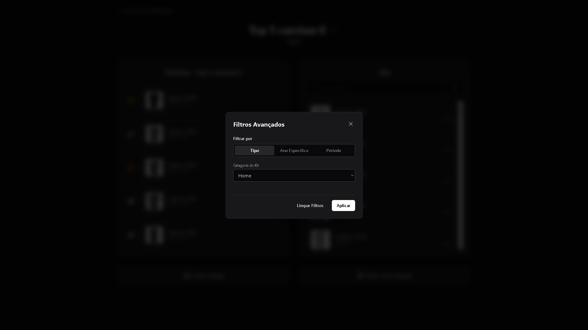

# T-Mão Ranking 

API REST para criação e gerenciamento de rankings personalizados de camisas do Corinthians. Desenvolvida como projeto acadêmico para a disciplina de Programação Orientada a Objetos da FATEC-BS, sob orientação do Prof. Alexandre Garcia. **Nota: 9/10.**

> 🖥️ Repositório do frontend: [tmao-frontend](https://github.com/walmirjr-dev/T-Mao-Ranking-frontend)

---

## 📸 Demonstração

Aqui estão algumas telas da aplicação em funcionamento:

### Construtor de Rankings

### Seção de Filtros de Camisas

### Lista de Rankings do Usuário

---

## 🚀 Funcionalidades

- **Banco de Dados Populado (Seeding):** Catálogo de camisas do Corinthians totalmente mapeado e atualizado com dados históricos **até o ano 2000**.
- Cadastro e autenticação de usuários com JWT
- Criação de rankings do tipo TOP 3, TOP 5 e TOP 10
- Busca e filtragem de kits por nome, tipo (HOME, AWAY, SPECIAL), ano específico e faixa de anos
- Exportação do ranking como imagem
- Controle de acesso por roles — apenas administradores podem cadastrar, editar e remover kits
- Cada usuário visualiza e gerencia apenas seus próprios rankings

---

## 🛠️ Tecnologias

### Backend
- Java 21
- Spring Boot 3
- Spring Security + JWT + BCrypt
- Spring Data JPA + Hibernate
- PostgreSQL
- Flyway (migrações versionadas)
- Docker

---

## 🏗️ Arquitetura

backend/

├── controller/       # Endpoints REST

├── service/          # Regras de negócio

├── repository/       # Acesso a dados (Spring Data JPA)

├── domain/           # Entidades e enums

│   └── enums/        # KitType, RankingType, Role

├── dto/

│   ├── request/      # DTOs de entrada (Java Records)

│   └── response/     # DTOs de saída (Java Records)

├── exception/        # Exceções customizadas + GlobalExceptionHandler

├── security/         # JwtService, JwtFilter, UserDetailsServiceImpl

└── config/           # Configurações de segurança e CORS

---

## 🗄️ Modelo de dados

- `tb_users` — usuários com roles (USER, ADMIN)
- `kits` — camisas com tipo (HOME, AWAY, SPECIAL), ano e imagem
- `rankings` — ranking pertencente a um usuário, com tipo (TOP_3, TOP_5, TOP_10)
- `kit_rankings` — associação entre ranking e kit com posição, usando chave composta `@EmbeddedId`

---

## 📡 Endpoints principais

### Auth
| Método | Rota | Descrição | Acesso |
|--------|------|-----------|--------|
| POST | `/auth/login` | Login, retorna token JWT | Público |
| POST | `/users` | Cadastro de usuário | Público |

### Kits
| Método | Rota | Descrição | Acesso |
|--------|------|-----------|--------|
| GET | `/kits` | Lista todos os kits | Autenticado |
| GET | `/kits/{id}` | Busca kit por id | Autenticado |
| GET | `/kits/search?name=` | Busca por nome | Autenticado |
| GET | `/kits/search/type/{type}` | Filtra por tipo | Autenticado |
| GET | `/kits/search/year/{year}` | Filtra por ano | Autenticado |
| GET | `/kits/search/year?startYear=&endYear=` | Filtra por faixa de anos | Autenticado |
| POST | `/kits` | Cadastra kit | Admin |
| PUT | `/kits/{id}` | Atualiza kit | Admin |
| DELETE | `/kits/{id}` | Remove kit | Admin |

### Rankings
| Método | Rota | Descrição | Acesso |
|--------|------|-----------|--------|
| GET | `/rankings` | Lista rankings do usuário logado | Autenticado |
| GET | `/rankings/{id}` | Detalhe do ranking com posições | Autenticado |
| POST | `/rankings` | Cria ranking | Autenticado |
| PUT | `/rankings/{id}` | Atualiza ranking | Dono |
| DELETE | `/rankings/{id}` | Remove ranking | Dono |
| POST | `/rankings/{id}/kits` | Adiciona kit ao ranking | Dono |
| DELETE | `/rankings/{id}/kits/{kitId}` | Remove kit do ranking | Dono |

---

## 📚 Conceitos aplicados

- API REST com arquitetura em camadas
- Autenticação stateless com JWT e senhas hasheadas com BCrypt
- Autorização por roles (USER/ADMIN) e ownership de recursos
- Relacionamentos JPA: `@ManyToOne`, `@OneToMany`, chave composta com `@EmbeddedId` e `@MapsId`
- DTOs com Java Records para desacoplamento da camada de domínio
- Tratamento centralizado de exceções com `@ControllerAdvice`
- Migrações versionadas com Flyway
- Injeção de dependência por construtor
- Context API para gerenciamento de estado no frontend
- Interceptors Axios para injeção automática de token

## 🌐 Deploy

O serviço completo foi deployado no plano gratuito do Render ->  [T-mão Ranking](https://t-mao-ranking-fe.onrender.com)
